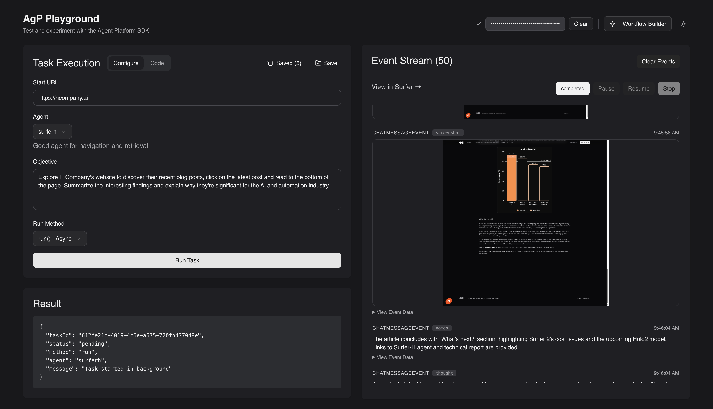

# AgP Playground

An interactive playground for working with hcompany agents. This application provides a user-friendly interface to run web automation agents, view real-time events, and experiment with different SDK methods.



## Features

- **Multiple Run Methods** - Test different SDK execution patterns:
  - `run()` - Async execution with manual control
  - `runAndWait()` - Synchronous execution that waits for completion
- **Real-Time Event Stream** - View agent events as they happen
- **Task Controls** - Pause, resume, and stop running tasks
- **Screenshot Support** - View agent screenshots with proxy authentication
- **Configuration Management** - Save and load task configurations - helpful for prompt engineering
- **Code Examples** - Generate SDK code snippets for your configurations
- **Workflow Builder** - Create and execute multi-step agent workflows

## Getting Started

### Prerequisites

- Node.js 18+ and pnpm

### Local Development

1. Clone the repository:

   ```bash
   git clone https://github.com/hcompai/agp-playground
   cd agp-playground
   ```

2. **Configure npm access token** (if you've been provided one):

   The AgP SDK is a private package that requires authentication to install. If you've been given an npm access token:

   ```bash
   # Copy the example .npmrc file
   cp .npmrc.example .npmrc

   # Export your npm token as an environment variable
   export NPM_TOKEN=npm_your_token_here
   ```

   Add the export to your shell profile (`~/.bashrc`, `~/.zshrc`, etc.) to make it persistent across sessions.

3. Install dependencies:

   ```bash
   pnpm install
   ```

4. Create a `.env.local` file:

   ```bash
   touch .env.local
   ```

5. Add your Agent Platform configuration to the `.env.local` file:

   ```bash
   NEXT_PUBLIC_AGP_BASE_URL=

   # Required for Workflow Builder
   AGP_API_KEY=your_api_key_here
   ```

   > **Note:** The `NEXT_PUBLIC_AGP_BASE_URL` is required for the SDK. The `AGP_API_KEY` is only needed if you want to use the Workflow Builder feature. For the main playground, the API key can be entered directly in the UI and is stored in your browser's local storage for convenience.

6. Start the development server:

   ```bash
   pnpm dev
   ```

7. Open [http://localhost:3000](http://localhost:3000) to see the app

## Usage

### Main Playground

1. **Authenticate** - Enter your Agent Platform API key and click "Initialize"
2. **Configure Task** - Set the start URL and objective for your agent
3. **Select Run Method** - Choose between `run()` or `runAndWait()`
4. **Execute** - Click "Run Task" to start your agent
5. **Monitor** - Watch real-time events in the Event Stream panel
6. **Control** - Use Pause, Resume, or Stop buttons to control execution

### Workflow Builder

The Workflow Builder allows you to create multi-step agent workflows using the [Workflow DevKit](https://github.com/vercel/workflow). This provides durability, fault tolerance, and step-by-step execution for complex agent tasks.

> **Note:** To use the Workflow Builder, you must set the `AGP_API_KEY` in your `.env.local` file as workflows are executed on the server side.

#### Inspecting Live Workflows

To view and debug running workflows in real-time, use the Workflow DevKit inspector:

```bash
npx workflow inspect runs --web
```

This opens a web interface where you can monitor workflow execution, view step-by-step progress, and debug any issues.

## Tech Stack

- [Next.js](https://nextjs.org) 15 (App Router)
- [agp-sdk-js](https://www.npmjs.com/package/agp-sdk-js) - Agent Platform SDK
- [Workflow DevKit](https://github.com/vercel/workflow) - Build durable, resilient workflows for multi-step agent tasks
- [TypeScript](https://www.typescriptlang.org)
- [Tailwind CSS](https://tailwindcss.com) - Styling with custom design system
- [shadcn/ui](https://ui.shadcn.com) - UI components

## Third-Party Licenses

This project uses the following open-source software:

### Workflow DevKit

- **License:** MIT License
- **Copyright:** Copyright (c) 2025 Vercel Inc.
- **Source:** https://github.com/vercel/workflow
- **License File:** [LICENSES/vercel-workflow.txt](LICENSES/vercel-workflow.txt)

The full license text is available in the `LICENSES/` directory.

## Learn More

- [HUB](https://hub.hcompany.ai/)
- [H.AI](https://hcompany.ai)
